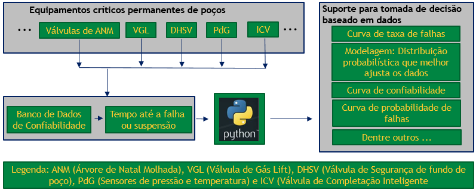

  
  

# *Osnney José Bandeira Leite*
  

  

# *Confiabilidade Quantitativa usando Python*

  

## *Monografia de Final de Curso*

  

**03/01/2021** 

  

#### **Monografia apresentada ao Departamento de Engenharia Elétrica da PUC/Rio como parte dos requisitos para a obtenção do título de Especialização em Business Intelligence.**

  

**Orientador:**

**Jose Bermudez, Ph.D**

  

### **Dedicatória**

Aos meus pais e professores da PUC-Rio do MBA em Ciência de Dados (BI Master)

### **Agradecimentos**

Ao programa E&amp;P-Competências da Petrobras que como integrante do desafio D6 que trata de Integridade, Confiabilidade e Descomissionamento me proporcionou a participação nesta pós-graduação em ciência de dados onde tive oportunidade de desenvolver competências em transformação digital.

Aos meus gerentes que me indicaram e liberaram para participar do programa E&amp;P-Competências.

Aos engenheiros de confiabilidade Luís da Costa Filho e João Paulo Gurgel que simularam os dados no software Weibull++ da Reliasoft utilizados na prova de conceito.

  

### **RESUMO**

Este trabalho apresenta uma metodologia para a utilização da engenharia de confiabilidade quantitativa como uma ferramenta de suporte para a tomada de decisão baseada em dados mediante a análise do histórico de falhas de equipamentos permanentes em poços. O método proposto visa predecir o ponto da falha baseado na estimativa da distribuição probabilística que melhor se ajusta aos dados.

A partir desta definição consegue-se levantar uma série de informações de confiabilidade quantitativa que ao serem aplicadas a dados reais agregam valor ao negócio, assim como geração de conhecimento.

Os desafios na produção de petróleo em águas ultra-profundas são crescentes e se precisa de uma metodologia para avaliar a confiabilidade dos equipamentos com finalidade futura de incluir requisitos de confiabilidade quantitativa nas especificações técnicas dos contratos de acordo com o cenário em que serão instalados.

  

### **ABSTRACT**

This work presents a methodology for the use of quantitative reliability engineering as a support tool for decision-making based on data, observing the past as a way of future prediction when treating and analyzing time data until the failure of permanent equipment simulating which probabilistic distribution best fits our data.

From this definition it is possible to raise a series of quantitative reliability information that when applied to real data add value to the business generating knowledge.

The challenges in oil production in ultra-deep waters are growing and we need a methodology to assess the reliability of this equipment for the future purpose of including requirements for quantitative reliability in the technical specifications of the contracts according to the scenario in which they will be installed.

  
  

### **Sumário**

  

1. INTRODUÇÃO
    - MOTIVAÇÃO
    - OBJETIVOS DO TRABALHO
    - DESCRIÇÃO DO TRABALHO

2. DESCRIÇÃO DO PROBLEMA

3. METODOLOGIA

4. RESULTADOS

    - Resultados obtidos com o algoritmo desenvolvido em Python

    - Resultados obtidos com o software Weibull++ da Reliasoft

5. CONCLUSÕES E TRABALHOS FUTUROS

Referências Bibliográficas

Anexo 01 – Algoritmo desenvolvido em Python

  
  

1. **INTRODUÇÃO**

Na perfuração de poços de petróleo marítimos, em especial em águas ultra profundas, como é o caso dos poços do pré-sal, localizados em torno de 2000 metros de linha d&#39;água, se precisa de equipamentos de elevada disponibilidade para reduzir sua intervenção o máximo possível. Dadas as condições adversas de operação e difícil acesso, a intervenção dos equipamentos requer longos intervalos de tempo (uma intervenção no poço do tipo heavy workover leva em média 80 dias), e instalações dedicadas, repercutindo em elevados custos diários. Por este motivo, a manutenção é pouco frequente, precisando-se que os equipamentos instalados forneçam uma alta confiabilidade para garantir que a disponibilidade seja a mais alta possível. Desta forma, faz-se necessária a implementação de uma metodologia que meça a confiabilidade dos equipamentos com o objetivo de estimar de forma eficiente os tempos de intervenção. Nesta ordem de ideias, este trabalho proporciona uma alternativa a esta problemática, propondo uma metodologia fundamentada em técnicas estatísticas de análise de confiabilidade.

Quando se fala em desenvolvimento de modelos estatísticos, a definição de critérios de validação do modelo proposto é de fundamental importância na análise de dados, que segundo Bozdogan (1987) deve ser o mais simples possível e que envolva o mínimo de parâmetros a serem estimados que representem o comportamento dos dados. Estudos sobre critérios de validação de modelos estatísticos estão disponíveis, como por exemplo Wolfinger (1993). Os critérios mais utilizados são os baseados no máximo da função verossimilhança (MFV), notadamente o teste da razão da verossimilhança (TRV) que é o utilizado no software Weibull++, e os critérios de informação de Akaike (AIC) e bayesiano de Schwarz (BIC) utilizados na biblioteca reliability. De forma geral, existem diversas distribuições probabilísticas, cada uma apresenta uma formulação da função taxa de falha, que são funções bem estudadas, e, portanto, são muito utilizadas para ajuste e análise preditiva de dados com finalidade de previsibilidade futura em estudos de confiabilidade quantitativa.

Em termos gerais, define-se a confiabilidade como a capacidade que tem um equipamento sem falhar. Embora, para poder medir a confiabilidade é necessário o entendimento da função do equipamento e seus modos de falhas. Neste sentido, na literatura existem técnicas que atingem esse objetivo, destacando-se as FMECA (Failure Mode, Effects and Critical Analysis), as quais são amplamente adotadas na área de poços. Nesta indústria, cada dia tomam mais relevância as ferramentas de engenharia de confiabilidade como um suporte essencial para a tomada de decisões baseado em dados, e assim puder alcançar e manter o alto desempenho dos ativos em todo o seu ciclo de vida Calixto (2016).

Destaca-se o trabalho feito por Rausand (2003), o qual estabeleceu a teoria da confiabilidade de sistemas para um determinado modo de falha, desenvolvido a metodologia para calcular a taxa de falha, a função densidade de probabilidade de falha, a função confiabilidade, e a função de probabilidade acumulada de falha de acordo com a distribuição probabilística que melhor ajusta os dados. Neste estudo, alguns componentes apresentaram maior tendência de falha no início da operação, seguido de uma fase estabilizada, e uma etapa de aumento da taxa de falha conforme o desgaste e envelhecimento do item. Devido a este comportamento, a representação gráfica da taxa de falha versus tempo foi denominada de curva da banheira.

Assim mesmo, Minuzzo et al (2015) utilizou conceitos de confiabilidade na tomada de decisão para redução de falhas associados aos processos produtivos em uma máquina de montagem automática de capacitores, e Santos (2017) fez um trabalho baseado na teoria de confiabilidade paramétrica coletando dados até a falha de dezesseis equipamentos. Para estes estudos, utilizou-se testes de aderência chi2 e kolmogorov-Smirnov para verificar a distribuição probabilística que melhor modelasse os base de dados e os parâmetros foram determinados pelo método da máxima verossimilhança.

Os resultados obtidos neste trabalho serão comparados aos resultados obtidos rodando um software comercial chamado Weibull++ da empresa Reliasoft que se propõe a realizar estudos de análises de vida de equipamentos em geral, sendo esta a prova de conceito (&quot;PoC – Poof of Concept&quot;) para validação desta aplicação.

A norma ABNT NBR ISO 14224 define os termos confiabilidade, mantenabilidade e disponibilidade da seguinte forma:

- Confiabilidade é a capacidade de um item desempenhar uma função requerida sob condições especificadas durante um determinado intervalo de tempo. A confiabilidade é, portanto, uma característica intrínseca ao item.

- Mantenabilidade é a capacidade de um item, sob determinadas condições de uso, de ser mantido ou restaurado para um estado em que possa desempenhar uma função requerida, quando a manutenção é realizada sob condições específicas e usando os procedimentos e recursos estabelecidos.

Disponibilidade é, portanto, uma probabilidade de um item estar apto a desempenhar uma função requerida, sob determinadas condições, num dado instante ou durante um determinado intervalo de tempo, considerando que os recursos externos necessários sejam fornecidos. A disponibilidade depende da confiabilidade e da estratégia de manutenção do item, sendo representada pela soma da confiabilidade mais a mantenabilidade.

Assim, a definição clássica de confiabilidade é a probabilidade de um item ou sistema funcionar, sem falhas, por um determinado período de tempo e sob determinadas condições operacionais.

Confiabilidade é parte de um sistema. Para analisarmos confiabilidade sistemicamente, a engenharia de confiabilidade trata de dois outros assuntos: Mantenabilidade e Disponibilidade.

Enquanto que confiabilidade é a probabilidade de um item ou sistema funcionar sem falhas por um determinado período de tempo, a mantenabilidade é a probabilidade do equipamento retornar de uma falha, em determinado período de tempo, de um ato de manutenção. A mantenabilidade é uma faixa de probabilidade.

A disponibilidade é um conceito que mistura a confiabilidade e a mantenabilidade pensando no item ou sistema estarem disponíveis no momento em que precisarmos dele. Então estamos falando de um sistema parado, onde tenho os tempos produtivos e não produtivos onde estou realizando a manutenção. Assim, a disponibilidade é a probabilidade de um sistema parado estar disponível quando solicitado.

Além disto, para tratarmos sistemicamente a confiabilidade, temos de inserir a perspectiva de ciclo de vida do poço, que é onde mais a confiabilidade é importante.

Esta mesma norma também define modo de falha como o efeito pelo qual uma falha é observada, no item que falhou, entendendo-se como falha o término da capacidade de um item desempenhar uma função requerida. Sendo a causa da falha, as circunstâncias associadas ao projeto, fabricação, instalação, uso ou manutenção, que conduzem a uma falha. Quando a eliminação desta falha é capaz de evitar que o mesmo tipo de falha ocorra em itens similares, esta é denominada de causa raiz e sua identificação é um dos principais objetivos de uma investigação de falha.

A linguagem de programação Python é muito utilizada atualmente não somente por ser uma linguagem de programação &quot;open source&quot; sem custos associados de aquisição e manutenção, mas também pela grande quantidade de bibliotecas disponíveis que facilitam os trabalhos de desenvolvedores, pois possuem pacotes implementados em python trazendo soluções prontas para:

- Análise e tratamento de dados: biblioteca Pandas;

- Visualização e plotagem gráfica: Biblioteca MatPlotLib

- Operações Científicas: biblioteca Numpy

- Análises estatísticas: biblioteca Scipy

- Representação e solução de equações diferenciais e integrais: biblioteca Sympy

- Análise de confiabilidade: biblioteca Reliability

Este trabalho utiliza boa parte destas bibliotecas citadas no desenvolvimento de uma aplicação para estudos de confiabilidade quantitativa para variáveis aleatórias contínuas, como por exemplo em equipamentos permanentes de poços de petróleo, que estão sob regulação da ANP através da RANP46 (2016).

Reide (2020) implementou a biblioteca python reliability que é uma biblioteca Python para engenharia de confiabilidade e será a base do desenvolvimento desta aplicação.

  
  

  1. **MOTIVAÇÃO**

Falhas aleatórias em equipamentos permanentes de poços são muito comuns e representam vultosos gastos por estarem montados no leito submarino ou instaladas nos poços submarino, possuindo mantenabilidade muito baixa e para se conseguir uma elevada disponibilidade precisa-se, portanto que eles possuam elevada confiabilidade.

Atualmente, quando se fala em confiabilidade de equipamentos permanentes de poços, no máximo chega-se a elaborar FMECA´s (Modos de Falhas, seus Efeitos e Criticidade) onde lista-se todos os modos de falha do equipamento, levanta-se suas ocorrências, severidade e detecção e chega-se a um número preliminar de risco pelo produtório destas três variáveis.

Este trabalho parte do modo de falha e com os tempos até a falha, ou o números de acionamentos até a falha propõe-se uma metodologia do levantamento de dados de confiabilidade quantitativa destes equipamentos possibilitando assim um melhor conhecimento do equipamento e por conseguinte menor risco associado, um melhor planejamento das intervenções e principalmente, fornecer subsídios para inclusão de requisitos de confiabilidade nas especificações técnicas de contratações destes equipamentos, pois teremos como realizar a medição dos requisitos de confiabilidade.

Os valores envolvidos são consideráveis, por exemplo, analisou-se os dados de uma única sonda marítima, e para falhas de válvulas de segurança de fundo de poço (DHSV´s) tivemos 08 poços com falhas de um total 21 poços, o que é um número alto. Destes, 06 falhas foram de válvulas DHSV´s, sendo que 04 foram encamisadas e 02 com pressão trapeada na ANM (Árvore de Natal Molhada), ou seja travada aberta. Nenhuma destas falhas superaram a marca de 07 anos de funcionamento, ou seja, o tempo máximo até a falha foi de 07 anos, o que é muito pouco tempo haja vista que os EVTE´s dos poços (Estudo de Viabilidade Técnico e Econômico) são calculados para 25 anos. Pode-se calcular facilmente, sem considerar o lucro cessante, e apenas os principais custos de intervenção, para somente estas 04 falhas de DHSV que precisaram ser encamisadas, considerando 30 dias para cada light workover e USD 300.000 de diária de sonda, tem-se um custo de intervenção de USD 36 milhões que poderiam ter sido evitados se as DHSV´s não tivessem falhados em pelo menos 10 anos (Tempo operacional destas DHSV´s).

Conhecer a confiabilidade destes equipamentos, nos cenários onde serão instalados, é fundamental para uma tomada de decisão assertiva de seleção de tecnologias e um bom planejamento de intervenções de curto, médio e longo prazo pois são operações intensivas de capital e que, portanto, precisa-se de assertividade.

  
  

  1. **OBJETIVOS DO TRABALHO**

Fornecer uma ferramenta, uma técnica para avaliação quantitativa de confiabilidade de equipamentos aplicadas a variáveis aleatórias contínuas, através da elaboração de um algoritmo em Python, com aplicação direta em equipamentos permanentes de poços devido a seus elevados custos de intervenção associados.

  
  

  1. **DESCRIÇÃO DO TRABALHO**

Esta monografia utiliza métodos estatísticos de apoio a decisão (MEAD) e seu desenvolvimento envolveu 06 etapas:

- Revisão bibliográfica na introdução;

- Descrição do problema;

- Metodologia utilizada: Elaboração do algoritmo em python e Simulações no software Weibull++ da Reliasoft;

- Resultados: Comparação dos resultados obtidos para a realização da Prova de Conceito: PoC (&quot;Proof of Concept&quot;);

- Conclusão e Trabalhos Futuros;

- Anexo 01 – Algoritimo desenvolvido em Python.

Esta monografia está dividida em seis capítulos adicionais, descritos a seguir:

O capítulo 02 apresenta a descrição do problema a que este trabalho pretende ser uma alternativa de aplicação.

O capítulo 03 apresenta as metodologias utilizadas: Elaboração detalhada do algoritmo em python e Simulações no software Weibull++ da Reliasoft utilizando a mesma base de dados simula qual o ranqueamento das distribuições probabilísticas melhor ajusta a base de dados.

O capítulo 04 faz uma comparação com os resultados obtidos como prova de conceito para validação da metodologia proposta neste trabalho.

O capítulo 05 traz as considerações finais e propostas de trabalhos futuros.

  
  

1. **DESCRIÇÃO DO PROBLEMA**

Na perfuração de poços de petróleo marítimos precisa-se de equipamentos com elevada disponibilidade, pois a mantenabilidade é baixa, portanto, é necessário elevada confiabilidade para ter-se disponibilidade alta destes equipamentos.

Exemplo de um equipamento permanente de poço é a válvula DHSV (&quot;DownHole Safety Valve&quot;), que é uma válvula de segurança de poço, que se não abrir quando deveria abrir causa um problema de produção (perdas devido a lucro cessante) e se não fechar, quando deveria fechar, causa um problema de integridade, de segurança.

Atualmente temos uma população de mais de 350 DHSV´s instaladas hoje nos poços da Petrobras, e com uma forte demanda de instalação destas válvulas face a entrada em vigor a partir de 07 de novembro de 2020 do regulamento técnico SGIP instaurado a partir da Instrução Normativa IN N.o 46 ANP.

Até Ago/2020 tivemos cerca de 49 falhas de DHSV´s mapeadas, sendo que 63% causaram perda de produção e 33% problemas de integridade de poço com custos de intervenção associados da ordem de USD 200 milhões.

Tem-se feito um esforço considerável para inserir requisitos de confiabilidade nas especificações técnicas para a contratação destes equipamentos e uma das barreiras existentes é a de como medir se os requisitos de confiabilidade serão atendidos.

Esta monografia pretende trazer uma alternativa para solução deste problema, com o uso de uma metodologia relativamente simples, com uma ferramenta &quot;open source&quot;, com custos apenas de homem-hora e de implementação imediata, desde que os dados de tempo até a falha, por modo de falha estejam disponíveis.

  
  

1. **METODOLOGIA**

A técnica empregada nesta monografia, está representado de forma simplificada no fluxograma presente na figura 01 e utiliza métodos estatísticos de apoio à decisão (MEAD) utilizando como ferramenta a linguagem de programação Python para elaboração de um algoritmo que pode ser rodado em ambiente de nuvem (Por exemplo o Colab da Google, ou o Lab Cognitive da IBM) ou através do software Jupyter Notebook que pode ser baixado gratuitamente em dispositivos particulares ou corporativos. O algoritmo do código em python está no anexo 01 desta monografia.

  
  Figura 01 – Fluxograma simplificado da metodologia proposta neste trabalho.

Este trabalho visa desenvolver uma aplicação para estes conceitos de ajustes de distribuições probabilísticas a uma amostra de dados de variáveis aleatórias contínuas. Conceitos estes largamente estudados e consolidados.

O estudo foi realizado utilizando-se a infraestrutura em nuvem do Google Colab usando Python 3 como versão mais atualizada do software até o presente momento.

O mesmo estudo foi desenvolvido utilizando um software comercial Weibull ++ da empresa Reliasoft e os resultados foram comparados com o objetivo de funcionar como uma PoC (&quot;Proof of Concept&quot;), uma prova de conceito para validar a metodologia proposta.

  
  

4. **RESULTADOS**

    * Resultados obtidos com o algoritmo desenvolvido em Python

O Algoritmo do código desenvolvido em python está disponível no anexo 01 deste trabalho.

Para rodarmos o algoritmo utilizamos o seguinte exemplo hipotético: Uma amostra de 25 válvulas foram colocadas em operação e observada até a ocorrência do modo de falha &quot;vazamento externo&quot;. Os tempos em dias até a falha foram: 4.37, 19.49, 1.72, 0.85, 5.59, 11.18, 23.41, 23.02, 10.79, 13.31, 49.62, 7.26, 13.9, 30.6, 3.56, 25.05, 4.64, 3.63, 11.28, 35.71, 56.13, 6.45, 6.61, 17.85, 5.23

Ao rodarmos o algoritmo após a instalação das bibliotecas necessárias é a verificação de qual distribuição probabilística melhor se ajusta aos dados carregados;

Os resultados numéricos dos parâmetros das distribuições probabilísticas e seus respectivos testes de aderência estão representados na figura 02 e graficamente na figura 03.

  

  Figura 02 – Resultado da simulação usando Python para os dados de tempo até a falha do Exemplo.

Observe que a figura 02 traz um ranqueamento crescente das distribuições probabilísticas que melhor ajustam os dados, sendo que a distribuição exponencial é a que melhor ajusta os dados seguida pela distribuição gamma.

   </img>

  Figura 03 – Representação gráfica dos resultados da simulação usando Python para os dados de tempo até a falha do Exemplo utilizado. The best fitting distribution was Exponential\_1P which had parameters [0.06389776 0.]

Uma vez conhecida a curva que melhor ajusta os dados, passaremos a utilizá-la para a aquisição dos parâmetros quantitativos de confiabilidade.

A figura 04 apresenta os resultados de confiabilidade quantitativa para a distribuição que melhor ajustou os dados, que para o exemplo 01, foi a função exponencial monoparamétrica.

   </img>
  Figura 04 – Confiabilidade quantitativa obtida graficamente para os dados do exemplo.

Na figura 04, temos um panorama geral dos parâmetros estatísticos e das curvas geradas através da aplicação da distribuição probabilística exponencial monoparamétrica que melhor ajustou nossos dados. A primeira das curvas é a de densidade de probabilidade das falhas (probability density function), seguida pela de probabilidade acumulada das falhas (cumulative distribution function) e de confiabilidade (survival fuction), além da função risco (Hazard function) e da função de risco acumulada (cumulative hazard function).

Estas curvas também podem ser obtidas utilizando a biblioteca scipy, mas traz uma dificuldade adicional de conhecermos a forma de declaração de cada distribuição probabilística. A simulação de dados quantitativos de confiabilidade através da biblioteca reliability é mais simples e direta, otimizando o algoritmo, pois passaremos a utilizar sempre o nome genérico a melhor distribuição dos resultados, assim conseguimos obter os mesmos resultados de uma forma mais eficiente, como pode ser observado na figura 05.

   </img> 

Figura 05 – Curva de confiabilidade obtida usando a biblioteca reliability.

De maneira geral faz-se necessário acessar as curvas individualmente e extrair seus valores. Por exemplo, pela figura encontramos que a confiabilidade para 5, 15, 20 e 25 anos são respectivamente 72, 38, 27 e 20%.

Para obter a probabilidade acumulada de falhas (também chamada de curva CDF) procede-se de acordo com a figura 05, onde observamos que a probabilidade de falha daqui a 15 anos será de 61,6%.

   </img> 

Figura 06 – Curva de probabilidade acumulada de falhas para o exemplo em questão.

Para obter a curva de densidade de probabilidade de falhas (também chamada de curva pdf) procede-se de acordo com a figura 06.

   </img> 

Figura 07 – Curva pdf (Densidade de Probabilidade de Falhas)

Perceba que somente utilizei dados de tempo até a falha. Estamos estudando a confiabilidade de válvulas DHSV´s, que como toda válvula, somente saberemos se está funcionando ao ciclá-la. Esta é uma informação importante no estudo de confiabilidade e deve ser levada em consideração, pois se a válvula funcionou ao ser acionada, aumento o conhecimento, diminuo os riscos uma vez que diminuo a incerteza e consequentemente aumento a confiabilidade da mesma.

São os dados até a suspensão, ou também chamados dados censurados à direita, que na biblioteca reliability são chamados right\_censored. Somente para efeito de treinamento de como se escreve o algoritmo, consideraremos um mesmo conjunto adicional de dados censurados do exemplo em estudo, ficando assim com o dobro de dados, sendo que metade deles representam dados de tempo até a falha e metade deles de tempo até a suspensão.

Assim, os resultados dos novos dados quantitativos de confiabilidade estão representados na figura 07.

   </img> 

Figura 08 – Resultados de parâmetros das distribuições probabilísticas levando em consideração dados censurados.

Observando a figura 07 nota-se que a melhor distribuição continua sendo a Exponential\_1P, só que seu parâmetro Lambda praticamente reduziu pela metade. Como o MTBF (Tempo médio entre falhas) para a função exponencial é o inverso de Lambda, ele praticamente dobrará, que é um ganho representativo de confiabilidade neste exemplo.

Podemos notar isto também analisando a nova curva de confiabilidade representada na figura 08, observada apenas para o intervalo de tempo entre 5 e 25 anos.

   </img> 

Figura 09 – Nova curva de confiabilidade usando dados censurados obtida usando a biblioteca reliability.

Perceba que a confiabilidade para 5, 15, 20 e 25 anos são respectivamente 85, 61, 52 e 44% de confiabilidade.

O aumento do conhecimento utilizando também os dados censurados representou um ganho expressivo de confiabilidade quando comparado apenas os dados de tempo até a falha.

4.2 – Resultados obtidos com o software Weibull ++

Os mesmos dados foram rodados no software Weibull ++ versão Reliasoft 2020, utilizando-se o contrato da ACV Tecline com a Petrobras que possuía a licença para seus 02 engenheiros de confiabilidade Luís Cesar da Costa Filho e João Paulo de Assis Gurgel.

Foram simuladas 11 distribuições probabilísticas representadas na figura X, que traz as respectivas distribuições probabilísticas com seus ranqueamentos. Quanto menor o ranqueamento, melhor a distribuição probabilística ajusta os dados.

Assim, através da utilização do Weibull ++, as 04 melhores distribuições probabilísticas que ajustam os dados são, em ordem crescente: Exponencial-1P, Gamma Generalizada, LogNormal e Weibull-3P, como pode ser visto na figura 09 através dos valores de ranqueamentos obtidos.

   </img> 

Figura 10 – Resultado da simulação com o software Weibull++.

Assim, através da utilização do Weibull ++, as 04 melhores distribuições probabilísticas que ajustam os dados são, em ordem crescente: Exponencial-1P, Gamma Generalizada, LogNormal e Weibull-3P.

Os parâmetros das distribuições, e os valores dos testes de aderência para LK, chi2 e k-s, para cada uma destas 04 distribuições, estão representadas na figura 10, assim como suas curvas de confiabilidade, probabilidade de falhas acumuladas, a curva pdf (densidade de probabilidade de falhas) e o gráfico da taxa de falha propriamente dita.

   </img> 

   </img> 

   </img> 

   </img> 

   </img> 

Figura 10 - Parâmetros das distribuições, e os valores dos testes de aderência para LK, chi2 e k-s, para cada uma das distribuições, assim como suas curvas de confiabilidade, probabilidade de falhas acumuladas, a curva pdf (densidade de probabilidade de falhas) e o gráfico da taxa de falha.

Os dados comparativos entre os resultados obtidos com python estão representados na tabela 01.

Tabela 01 – Resultados comparativos

| Melhor Ajuste | Python | Weibull ++ |
| --- | --- | --- |
| Primeiro | Exponencial-1P | Exponencial-2P |
| Segundo | Exponential-2P | Gamma-3P |
| Terceiro | Gamma-3P | LogNormal |
| Quarto | Weibull-3P | Weibull-3P |

  

Através da análise da tabela 01 podemos perceber que ambos os softwares identificaram as distribuições exponencial e Gamma-3P como as que melhor ajustam os nossos dados.

Divergências sempre ocorrerão, não deve-se esperar que os resultados sejam exatamente iguais, pois estamos falando de modelos e portanto aproximações da realidade, pois não se pode determinar com certeza qual distribuição sua amostra segue e o que buscamos é uma descrição aproximada dos dados, através de uma distribuição paramétrica específica que muito ajuda na modelagem dos dados e as variações dos resultados podem ser atribuídas aos diferentes critérios estatísticos de validação do melhor modelo de ajuste dos dados que no caso do Python foram o AIC (Critério de Informação de Akaike) e BIC (Critério Baysiano de Schwarz) e no caso do Weibull++ é o TRV, que é o teste da razão verossimilhança que utiliza uma combinação dos testes estatísticos k-s (Kolmogorov-Smirnoff), chi2 e valores de LK (somatório do logaritmo neperiano da verossimilhança).

Os três critérios apresentados apesar de conceitualmente diferentes dos modelos em avaliação, utilizam o mesmo critério estatístico, o máximo da função de verossimilhança como medida do ajustamento, entretanto, definem valores críticos diferentes.

Vale lembrar que este não é um resultado congelado, fixo, imutável pois é um trabalho contínuo, novas falhas irão ocorrer aumentando a base de dados e fazendo-se necessário fazer novas simulações que podem mudar o ranqueamento das distribuições. O importante é se ter um critério objetivo, com embasamento técnico de métodos estatísticos de apoio à tomada de decisão, mas não podemos esquecer, se não tivermos confiabilidade dos dados, o resultado pode ficar muito comprometido. Portanto, mais do que estabelecer uma metodologia para tratamento dos dados, precisamos trabalhar a implementação de uma cultura de confiabilidade de dados, que passam pelas seguintes etapas básicas de coleta e tratamento dos dados:

- A primeira etapa é coletar e registrar os dados de identificação dos poços, ou seja, a locação é se ele é submarino ou não, o nome do poço, dentre outros. Os atributos do banco de dados devem ser compostos pelo nome do poço, se ele é produtor ou injetor, quais são os componentes instalados neles, seus fabricantes, número de série, modelo, dentre outros;

- A segunda etapa é registrar as datas de instalação e de operação desses poços que é um dos principais atributos que a gente precisa para pelo menos conseguir calcular uma taxa de falha. Nesta etapa a gente tem as datas, a data da instalação, data de início de operação, se o componente ainda está instalado é ou se ele foi retirado e a última data de coleta de dados ou se está com falha. As datas das falhas, e o modo de falha, categoria de falha e várias outras informações que tem de ser coletada e consome muito tempo e homem-hora (HH), pois na maioria das vezes os dados não estão disponíveis e faz-se necessário desenvolver uma cultura de confiabilidade dos dados de forma estruturada, como exemplificamos, e preferencialmente norteados por uma norma, a exemplo da norma ISO 14224 que é a referência para a indústria de óleo e gás para coleta e tratamento de dados de confiabilidade e mantenabilidade.

- A terceira etapa é a coleta e registro dos dados de falha e de modos de falha, que também vai influenciar no cálculo da taxa de falha;

- A quarta etapa é o cálculo e registro das taxas de falhas.

- A quinta e última etapa é calcular as medidas de confiabilidade propriamente dita que é o nosso objetivo final utilizando a metodologia proposta neste estudo.

Assim, mais do que ter uma metodologia para tratamento destes dados, tem-se de desenvolver uma cultura, o que leva tempo, mas que é catalisada por regulamentos mais restritivos como o regulamento do SGIP (Sistema de Gestão de Integridade de Poços) instituído pela Instrução Normativa IN 46 da ANP que passou a vigorar a partir de 07/11/20.

  
  

1. **CONCLUSÕES E TRABALHOS FUTUROS**

Os objetivos propostos de levantamento de dados de confiabilidade quantitativa foram alcançados através da elaboração de um algoritmo utilizando uma ferramenta &quot;open source&quot; Python 3 e os resultados encontrados tiveram relativa aderência em relação ao software comercial Weibull++ da Reliasoft.

Pode-se dizer que os resultados foram bons e que podemos considerar válido o modelo proposto através da realização desta prova de conceito (PoC), pois ambos identificaram que as melhores distribuições probabilísticas de ajuste dos dados foram as distribuições exponencial e Gamma-3P, embora o modelo proposto tenha indicado a exponencial 1P e o Software Weibull++ a exponencial 2P.

Como sugestão de trabalhos futuros temos as seguintes proposições:

- Estabelecer e implementar uma cultura de confiabilidade de dados iniciando pela proposição dos atributos que uma base de dados para levantamento de confiabilidade quantitativa deve minimamente possuir;

- Aplicar a metodologia a dados reais de equipamentos permanentes de poço não-reparáveis;

- Aprofundar/refinar a metodologia para se conseguir avaliar vida residual de sistemas não-reparáveis;

- Uma vez que conseguimos definir a função curva de confiabilidade tem-se um novo desafio que é o de incluir e monetizar o risco confiabilidade na matriz de risco organizacional, fechando-se o ciclo e gerando valor para a tomada de decisão nas organizações.

**Referências Bibliográficas**

ABNT NBR ISO 14224. Indústrias de petróleo e gás natural – Coleta e intercâmbio de dados de confiabilidade e manutenção para equipamentos. Primeira edição. 31.10.2011

Bozdogan, Hamparsum. (1987). Model Selection and Akaike&#39;s Information Criterion (AIC): The General Theory and Its Analytical Extensions. Psychometrika. 52. 345-370. 10.1007/BF02294361.

Calixto, Eduardo. (2016). Gas and Oil Reliability Engineering Modeling and Analysis. Elsevier. 792 pgs.

Minuzzo, G. S.; Andrade, J. J. DE O. Estratégia de manutenção baseadas em análise de confiabilidade: Aplicação em uma máquina automática de montagem de capacitores. Revista Ingenieria Industrial Ano 14 n.3. 2015. 16 pgs . ISSN 0717-9103

RAUSAND, Marvin., HOYLAND, Arnljot. System Reliability Theory: Models, Statistical Methods, and Applications, 2nd Edition, 2003. 664p. ISBN: 978-0-471-47133-2.

Regulamento Técnico do Sistema de Gerenciamento da Integridade de Poços – SGIP. RESOLUÇÃO RANP Nº 46, DE 1º.11.2016 - DOU 3.11.2016 – RETIFICADO DOU 7.11.2016

Reid, M. (2020). Confiabilidade – uma biblioteca Python para engenharia de confiabilidade (Versão 0.5.1) [Software de computador]. O Zenodo. [https://doi.org/10.5281/ZENODO.3938000](https://doi.org/10.5281/ZENODO.3938000)

SANTOS, M. M. DE M.; SILVA, E. DA C.; FERREIRA, G. DE S.; ROSA, R. M. G.; ANDRADE, P. C. DE R. Modelagem do tempo de vida de um inversor de frequência.  **ForScience** , v. 5, n. 3, 27 nov. 2017.

Wolfinger, Russ. (1993). Covariance structure selection in general mixed models. Communications in Statistics-simulation and Computation - COMMUN STATIST-SIMULAT COMPUT. 22. 1079-1106. 10.1080/03610919308813143.

Anexo 01 – Algoritmo desenvolvido em Python

